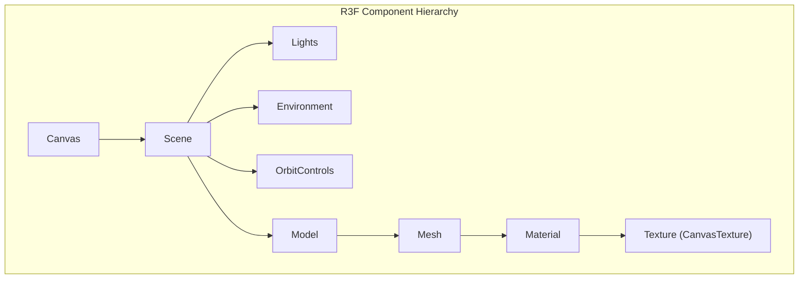

# 3D Pipeline

## Overview

The 3D pipeline covers GLB model requirements, optimization, scene setup, and React Three Fiber (R3F) integration for the 3D Customization Engine, targeting production-grade rendering with performance and accessibility in mind.

---

## GLB Model Requirements

| Requirement | Specification |
|-------------|---------------|
| **Format** | GLB (binary glTF) |
| **Size** | < 1.5MB compressed |
| **UV mapping** | Clean, single UV set for printable surface |
| **Materials** | One primary material for customizable surface |
| **Lighting** | No baked lighting |
| **Textures** | No embedded 4K textures |

---

## Optimization Pipeline

Using `gltf-transform` CLI:

```bash
gltf-transform optimize model.glb optimized.glb \
  --draco \
  --texture-compress webp \
  --meshopt
```

### Target Sizes

| Target | Size |
|--------|------|
| Mobile | < 1MB |
| Desktop | < 2MB |

### Optimization Steps

1. **Draco** — Mesh compression for geometry
2. **WebP textures** — Texture compression (Basis Universal / KTX2 for broader support)
3. **meshopt** — Vertex/index optimization

```typescript
// Programmatic optimization (Node.js)
import { NodeIO } from '@gltf-transform/core';
import { draco, meshopt } from '@gltf-transform/extensions';

const io = new NodeIO().registerExtensions([draco(), meshopt()]);
const document = await io.read('model.glb');
// ... optimize ...
await io.write('optimized.glb', document);
```

---

## Scene Setup

### Rendering Configuration

```typescript
// R3F Canvas configuration
<Canvas
  gl={{
    antialias: true,
    alpha: true,
    powerPreference: 'high-performance',
    toneMapping: THREE.ACESFilmicToneMapping,
    toneMappingExposure: 1,
  }}
  dpr={[1, 2]} // Adaptive DPR
  camera={{ position: [0, 0, 3], fov: 45 }}
>
  <Scene />
</Canvas>
```

### Scene Requirements

| Setting | Value | Purpose |
|---------|-------|---------|
| **PhysicallyCorrectLights** | `true` | Realistic lighting |
| **Tone mapping** | ACES | Film-like rendering |
| **HDRI environment** | Environment map | Reflections, ambient |
| **Adaptive DPR** | `[1, 2]` | Device pixel ratio |
| **OrbitControls** | Damping enabled | Smooth camera |

---

## Camera Controls

```typescript
import { OrbitControls } from '@react-three/drei';

<OrbitControls
  enableDamping
  dampingFactor={0.05}
  minDistance={1}
  maxDistance={10}
  maxPolarAngle={Math.PI / 2}
  enablePan={false}
/>
```

| Property | Value | Purpose |
|----------|-------|---------|
| `enableDamping` | `true` | Smooth inertia |
| `minDistance` | `1` | Prevent zoom in too close |
| `maxDistance` | `10` | Prevent zoom out too far |
| `enablePan` | `false` | Orbit only; no pan |

---

## Lazy Loaded Canvas with Suspense

```typescript
import dynamic from 'next/dynamic';
import { Suspense } from 'react';

const Canvas3D = dynamic(() => import('@/components/ConfiguratorCanvas'), {
  ssr: false,
  loading: () => <ConfiguratorSkeleton />,
});

export default function ProductPage() {
  return (
    <Suspense fallback={<ConfiguratorSkeleton />}>
      <Canvas3D productId={productId} />
    </Suspense>
  );
}
```

- **`ssr: false`** — Canvas/WebGL not rendered on server
- **Suspense** — Defers loading until needed
- **Skeleton** — Placeholder during load

---

## R3F Component Hierarchy



---

## Component Structure

```tsx
// ConfiguratorCanvas.tsx
import { Canvas } from '@react-three/fiber';
import { Environment, OrbitControls } from '@react-three/drei';
import { Suspense } from 'react';

function Scene({ productId, config }: Props) {
  const { scene } = useGLTF(product.glb_url);
  const texture = useTextureFromConfig(config);

  return (
    <>
      <ambientLight intensity={0.5} />
      <directionalLight position={[5, 5, 5]} intensity={1} />
      <primitive object={scene} />
      <mesh>
        <meshStandardMaterial map={texture} />
      </mesh>
      <Environment preset="studio" />
      <OrbitControls />
    </>
  );
}

export default function ConfiguratorCanvas({ productId, config }: Props) {
  return (
    <Canvas gl={{ toneMapping: THREE.ACESFilmicToneMapping }}>
      <Suspense fallback={null}>
        <Scene productId={productId} config={config} />
      </Suspense>
    </Canvas>
  );
}
```

---

## Texture Binding

```typescript
// When config changes:
const texture = useMemo(() => {
  const canvas = textureEngine.renderToCanvas(config);
  return new THREE.CanvasTexture(canvas);
}, [config]);

useEffect(() => {
  if (materialRef.current) {
    materialRef.current.map = texture;
    materialRef.current.needsUpdate = true;
  }
}, [texture]);
```

---

## Performance Considerations

| Strategy | Implementation |
|----------|----------------|
| **Lazy Canvas** | Dynamic import with `ssr: false` |
| **Suspense** | Wrap 3D scene for code splitting |
| **Adaptive DPR** | `dpr={[1, 2]}` for device capability |
| **KTX2** | Compressed textures where supported |
| **Draco** | Compressed geometry |
| **meshopt** | Optimized vertex/index buffers |
| **Texture size** | 2048×2048 max |
| **Debounce** | Debounce texture regeneration on config change |

---

## Lighting Setup

```tsx
<>
  <ambientLight intensity={0.4} />
  <directionalLight
    position={[5, 5, 5]}
    intensity={1}
    castShadow
    shadow-mapSize={[2048, 2048]}
  />
  <directionalLight position={[-3, 2, 2]} intensity={0.3} />
  <Environment preset="studio" />
</>
```

---

## Error Handling

```tsx
<ErrorBoundary fallback={<ConfiguratorError />}>
  <Suspense fallback={<ConfiguratorSkeleton />}>
    <ConfiguratorCanvas />
  </Suspense>
</ErrorBoundary>
```

---

## File Structure

```
components/
  configurator/
    ConfiguratorCanvas.tsx   # Canvas wrapper
    ConfiguratorScene.tsx    # Scene, lights, model
    ConfiguratorModel.tsx    # GLB with material
    ConfiguratorSkeleton.tsx  # Loading state
    ConfiguratorError.tsx     # Error state
lib/
  texture-engine.ts
  texture-engine-client.ts
```
