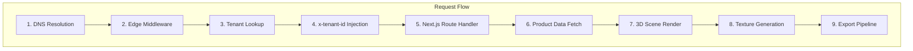
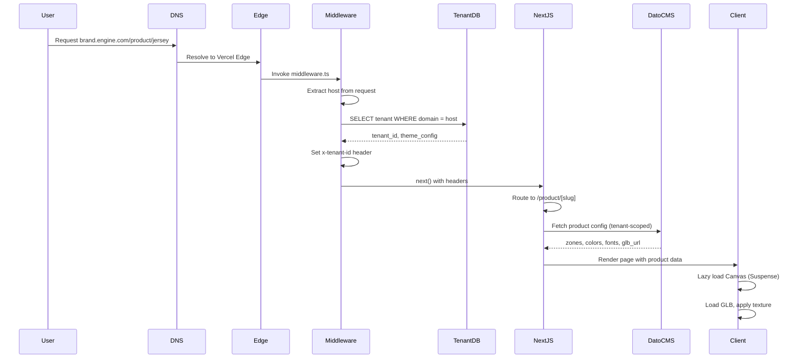
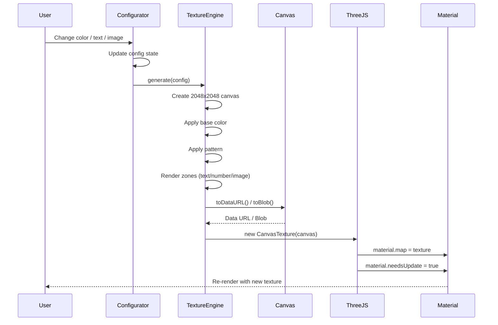
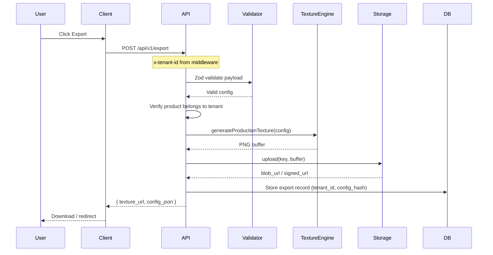
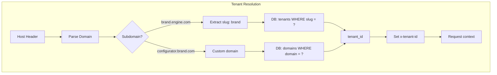
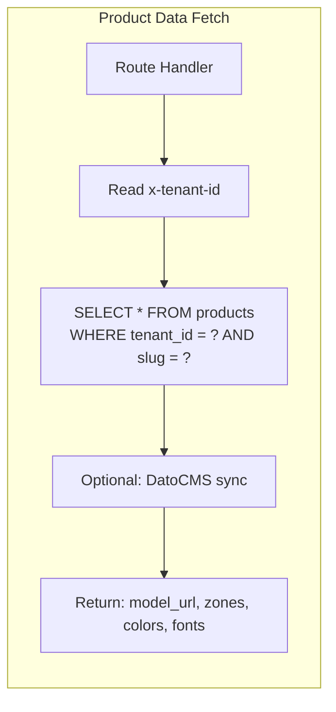
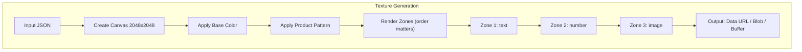
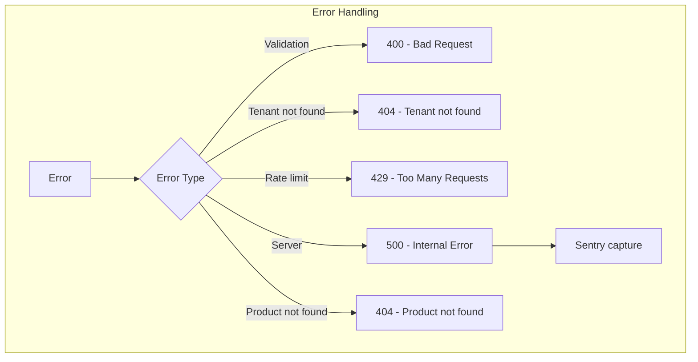

# Data Flow

## Request Flow Architecture

This document describes the end-to-end request flow through the 3D Customization Engine, from DNS resolution through the export pipeline.

---

## Request Flow Overview

---

## Sequence Diagram: Page Load & Configurator Init

---

## Sequence Diagram: Configuration Change & Texture Update

---

## Sequence Diagram: Export Pipeline

---

## Detailed Flow: Tenant Resolution

---

## Detailed Flow: Product Data Fetch

---

## Detailed Flow: Texture Generation Pipeline

---

## Header Propagation

| Stage | Header | Purpose |
|-------|--------|---------|
| Edge Middleware | `x-tenant-id` | Tenant identity for all downstream logic |
| API Routes | `x-tenant-id` | Read from `request.headers.get('x-tenant-id')` |
| Server Components | Via `headers()` | Access tenant for data fetching |
| Client | N/A | Tenant passed via props or React context |

---

## Caching Strategy

| Resource | Cache Location | TTL |
|----------|----------------|-----|
| Tenant config | Edge / Memory | 60s |
| Product config | CDN / React cache | 60s |
| GLB models | CDN | Immutable |
| HDRIs | CDN | Immutable |
| Generated textures | Client memory | Session |
| Export assets | Storage (signed URL) | 24h |

---

## Error Flow

