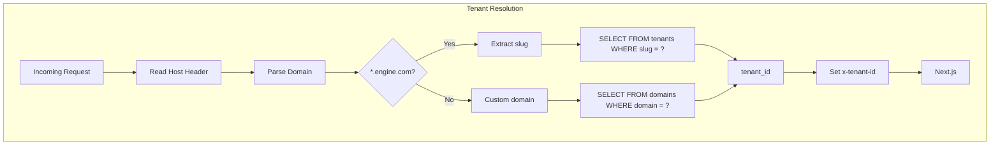
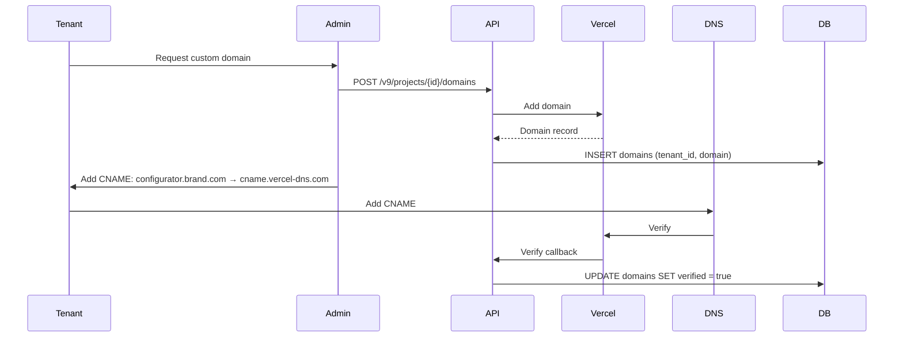

# Multi-Tenant Model

## Overview

The 3D Customization Engine is a **single-deployment, shared-infrastructure** multi-tenant SaaS. Tenants are isolated logically via `tenant_id` scoping on all data and operations. The system targets **1000+ tenants** with subdomain and custom domain support.

---

## Tenant Resolution Strategy

### Modes

| Mode | Example | Lookup Key |
|------|---------|------------|
| **Subdomain** | `brand.engine.com` | `slug` = `brand` from subdomain |
| **Custom domain** | `configurator.brand.com` | `domain` = full host |

### Resolution Flow



---

## Edge Middleware Flow

```typescript
// middleware.ts (runs at Edge)
import { NextResponse } from 'next/server';
import type { NextRequest } from 'next/server';
import { resolveTenant } from '@/lib/tenant';

export async function middleware(request: NextRequest) {
  const host = request.headers.get('host') ?? '';
  const tenant = await resolveTenant(host);

  if (!tenant) {
    return new NextResponse('Tenant not found', { status: 404 });
  }

  const requestHeaders = new Headers(request.headers);
  requestHeaders.set('x-tenant-id', tenant.id);

  return NextResponse.next({
    request: { headers: requestHeaders },
  });
}

export const config = {
  matcher: ['/((?!_next/static|_next/image|favicon.ico).*)'],
};
```

---

## Data Model

### Tenant Table

```sql
CREATE TABLE tenants (
  id UUID PRIMARY KEY DEFAULT gen_random_uuid(),
  name TEXT NOT NULL,
  slug TEXT NOT NULL UNIQUE,
  primary_domain TEXT,
  theme_config JSONB DEFAULT '{}',
  plan TEXT NOT NULL DEFAULT 'starter',
  status TEXT NOT NULL DEFAULT 'active' CHECK (status IN ('active', 'suspended', 'trial')),
  payment_provider TEXT DEFAULT 'stripe',
  created_at TIMESTAMPTZ DEFAULT NOW(),
  updated_at TIMESTAMPTZ DEFAULT NOW()
);

CREATE INDEX idx_tenants_slug ON tenants(slug);
```

| Column | Type | Description |
|--------|------|-------------|
| `id` | UUID | Primary key |
| `name` | TEXT | Display name |
| `slug` | TEXT | Subdomain identifier (e.g. `brand` → `brand.engine.com`) |
| `primary_domain` | TEXT | Primary custom domain if set |
| `theme_config` | JSONB | Theme overrides (colors, fonts, logo) |
| `plan` | TEXT | Billing plan |
| `status` | TEXT | `active`, `suspended`, `trial` |
| `payment_provider` | TEXT | `stripe` or `easypay` |

---

### Domain Table

```sql
CREATE TABLE domains (
  id UUID PRIMARY KEY DEFAULT gen_random_uuid(),
  tenant_id UUID NOT NULL REFERENCES tenants(id) ON DELETE CASCADE,
  domain TEXT NOT NULL UNIQUE,
  verified BOOLEAN DEFAULT FALSE,
  ssl_status TEXT DEFAULT 'pending' CHECK (ssl_status IN ('pending', 'active', 'error')),
  created_at TIMESTAMPTZ DEFAULT NOW(),
  updated_at TIMESTAMPTZ DEFAULT NOW()
);

CREATE INDEX idx_domains_domain ON domains(domain);
CREATE INDEX idx_domains_tenant ON domains(tenant_id);
```

| Column | Type | Description |
|--------|------|-------------|
| `id` | UUID | Primary key |
| `tenant_id` | UUID | FK to tenants |
| `domain` | TEXT | Full domain (e.g. `configurator.brand.com`) |
| `verified` | BOOLEAN | DNS verified |
| `ssl_status` | TEXT | SSL certificate status |

---

### Product Table

```sql
CREATE TABLE products (
  id UUID PRIMARY KEY DEFAULT gen_random_uuid(),
  tenant_id UUID NOT NULL REFERENCES tenants(id) ON DELETE CASCADE,
  name TEXT NOT NULL,
  slug TEXT NOT NULL,
  glb_url TEXT NOT NULL,
  zones JSONB NOT NULL DEFAULT '[]',
  colors JSONB NOT NULL DEFAULT '[]',
  fonts JSONB NOT NULL DEFAULT '[]',
  created_at TIMESTAMPTZ DEFAULT NOW(),
  updated_at TIMESTAMPTZ DEFAULT NOW(),
  UNIQUE(tenant_id, slug)
);

CREATE INDEX idx_products_tenant ON products(tenant_id);
CREATE INDEX idx_products_tenant_slug ON products(tenant_id, slug);
```

| Column | Type | Description |
|--------|------|-------------|
| `id` | UUID | Primary key |
| `tenant_id` | UUID | FK to tenants |
| `name` | TEXT | Display name |
| `slug` | TEXT | URL slug |
| `glb_url` | TEXT | URL to GLB model |
| `zones` | JSONB | Personalization zones |
| `colors` | JSONB | Available color options |
| `fonts` | JSONB | Available font options |

---

## Tenant Isolation

All queries must be scoped by `tenant_id`:

```typescript
// ✅ Correct
const products = await db
  .select()
  .from(products)
  .where(eq(products.tenant_id, tenantId));

// ❌ Wrong
const products = await db.select().from(products);
```

---

## Custom Domain Onboarding

### Vercel Domains API



### CNAME Configuration

Tenant must add:

```
configurator.brand.com  CNAME  cname.vercel-dns.com
```

Verification is done via Vercel Domains API.

---

## Theme Config Schema

```typescript
interface ThemeConfig {
  primary_color?: string;
  secondary_color?: string;
  font_family?: string;
  border_radius?: string;
  logo_url?: string;
}
```

Loaded at runtime and applied via CSS variables:

```css
:root {
  --primary: var(--tenant-primary, #000);
  --secondary: var(--tenant-secondary, #fff);
}
```

---

## Scale Target: 1000+ Tenants

| Strategy | Implementation |
|----------|----------------|
| **Shared DB** | Single Neon schema; all tables include `tenant_id` |
| **Indexed lookups** | `domains(domain)`, `tenants(slug)` for fast resolution |
| **Edge caching** | Cache tenant config at edge (60s TTL) |
| **Connection pooling** | Neon serverless pooling |

### Future Scaling (Enterprise)

- Separate DB schemas per tenant
- Dedicated Postgres per enterprise
- Edge Config for tenant config
- Region-specific deployments

---

## Security Model

| Rule | Implementation |
|------|----------------|
| **Query scoping** | All DB queries include `tenant_id` |
| **Row-Level Security** | Optional RLS on tenant-scoped tables |
| **Signed URLs** | Exports use time-limited signed URLs |
| **No cross-tenant access** | Validate `tenant_id` on every API call |
