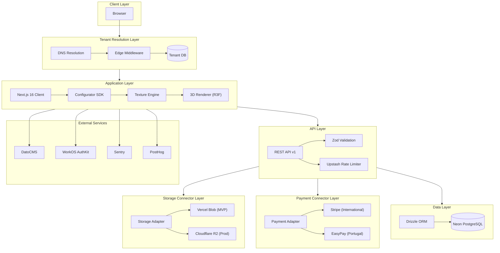
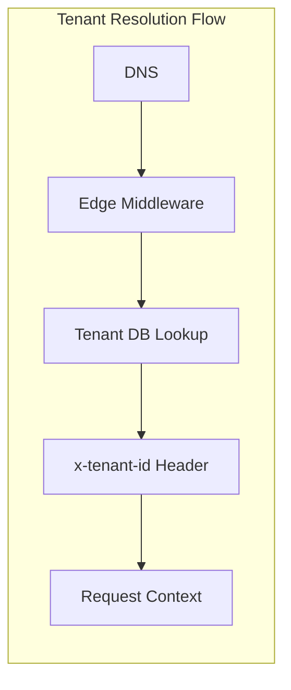
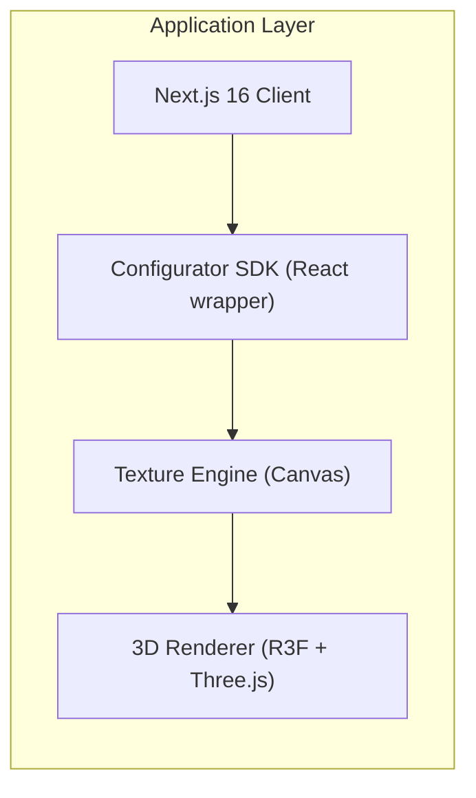
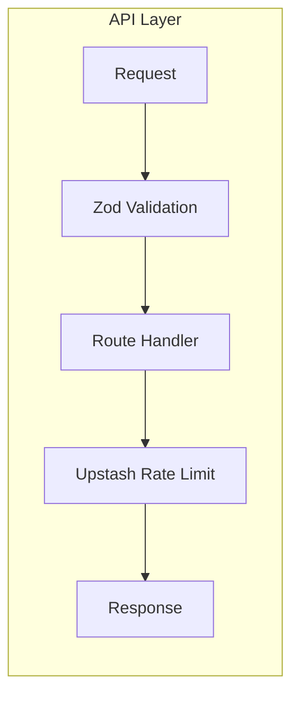
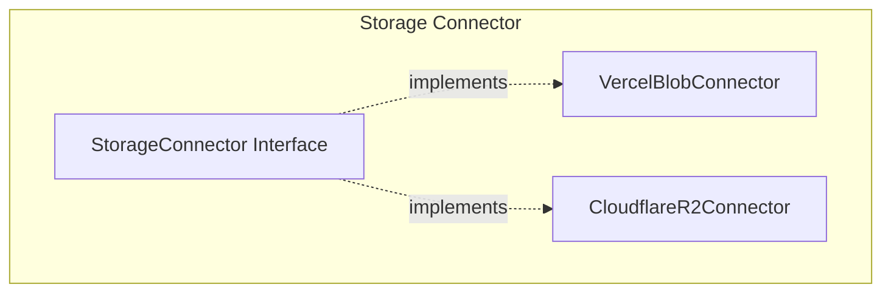
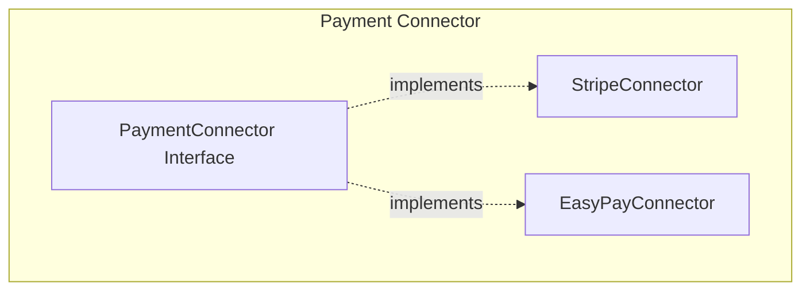
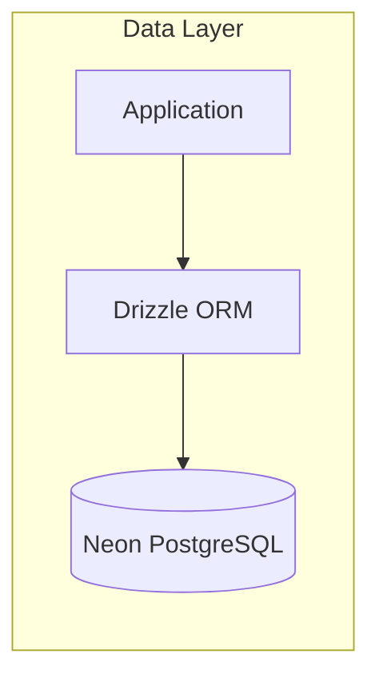
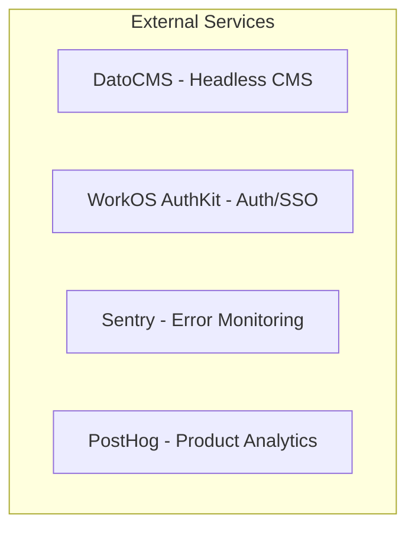
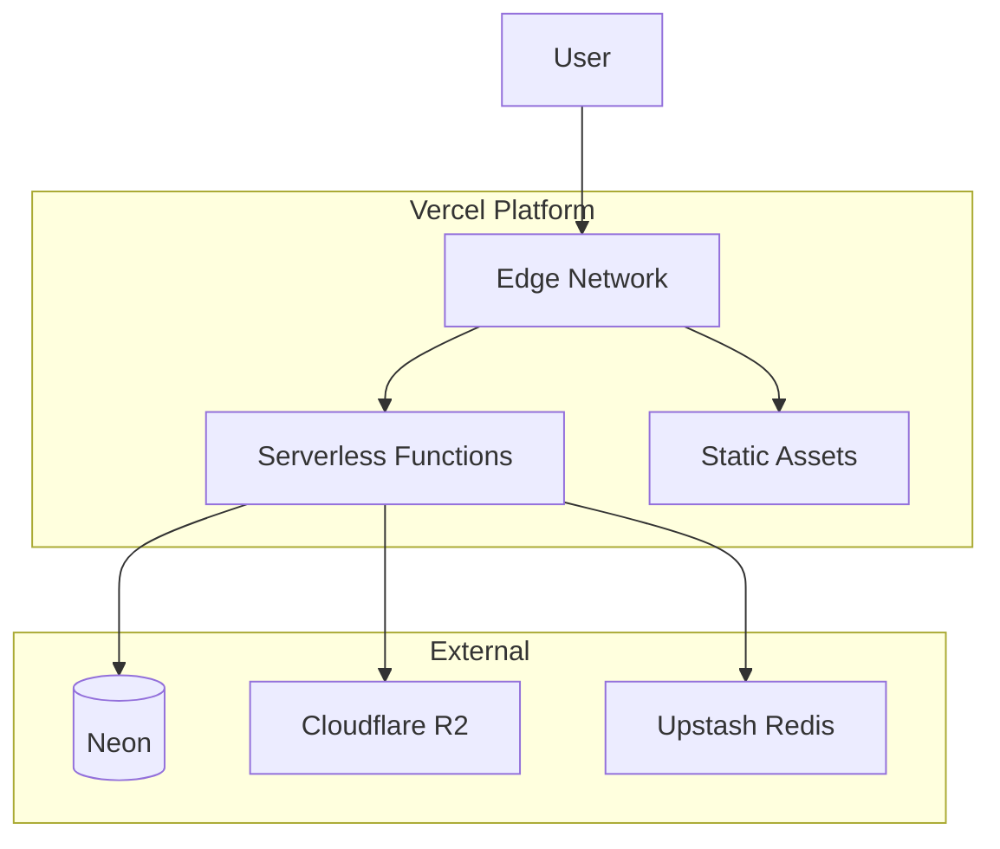

# System Overview

## 3D Customization Engine — Multi-Tenant SaaS Architecture

A production-grade, multi-tenant 3D product customization platform (similar to Nike.com customizer) built with Next.js 16, React 19, Three.js, React Three Fiber, TailwindCSS, and shadcn/ui. The system is designed for white-label deployment, commerce-agnostic operation, and scale to 1000+ tenants.

---

## High-Level Architecture

---

## Tenant Resolution Layer

Resolves tenant identity from incoming requests before any application logic executes.

| Component | Responsibility |
|-----------|----------------|
| **DNS** | Resolves subdomain (`brand.engine.com`) or custom domain (`configurator.brand.com`) to Vercel Edge |
| **Edge Middleware** | Reads `Host` header, queries Tenant DB by domain, injects `x-tenant-id` |
| **Tenant DB** | Stores `tenants`, `domains`; lookup by `domain` or `slug` (subdomain) |

---

## Application Layer

| Component | Technology | Responsibility |
|-----------|-------------|----------------|
| **Next.js Client** | Next.js 16, React 19 | App Router, SSR, routing, layout |
| **Configurator SDK** | React components | Product config UI, zone controls, theme application |
| **Texture Engine** | Canvas 2D API | Deterministic texture generation from zones |
| **3D Renderer** | R3F, Three.js, Drei | GLB loading, material binding, scene rendering |

---

## API Layer

| Component | Purpose |
|-----------|---------|
| **REST API v1** | Versioned endpoints under `/api/v1/` |
| **Zod Validation** | Request/response schema validation, type inference |
| **Upstash Rate Limiter** | Per-tenant rate limits, abuse prevention |

---

## Storage Connector Layer

Adapter pattern for object storage. Provider selected via `STORAGE_PROVIDER` env var.

| Implementation | Use Case | Provider |
|----------------|----------|----------|
| **VercelBlobConnector** | MVP, development | `@vercel/blob` |
| **CloudflareR2Connector** | Production, scale | `@aws-sdk/client-s3` + R2 |

---

## Payment Connector Layer

Adapter pattern for payment processing. Provider selected per tenant via `payment_provider` field.

| Implementation | Region | Methods |
|----------------|--------|---------|
| **StripeConnector** | International | PaymentIntents, Subscriptions, webhooks |
| **EasyPayConnector** | Portugal | Multibanco, MB WAY, Virtual IBAN |

---

## Data Layer

| Component | Purpose |
|-----------|---------|
| **Drizzle ORM** | Type-safe queries, migrations, schema management |
| **Neon PostgreSQL** | Serverless Postgres, branching, connection pooling |

---

## External Services

| Service | Purpose |
|---------|---------|
| **DatoCMS** | Product config, zones, colors, fonts; content management |
| **WorkOS AuthKit** | Authentication, SSO, RBAC |
| **Sentry** | Error tracking, performance monitoring |
| **PostHog** | Product analytics, feature flags, session replay |

---

## Deployment Topology

---

## Technology Stack Summary

| Layer | Technologies |
|-------|--------------|
| **Frontend** | Next.js 16, React 19, TailwindCSS, shadcn/ui |
| **3D** | Three.js, @react-three/fiber, @react-three/drei |
| **Backend** | Next.js Route Handlers, Drizzle ORM |
| **Database** | Neon PostgreSQL |
| **Storage** | Vercel Blob (MVP) / Cloudflare R2 (Prod) |
| **Payments** | Stripe / EasyPay |
| **Auth** | WorkOS AuthKit |
| **CMS** | DatoCMS |
| **Observability** | Sentry, PostHog |
