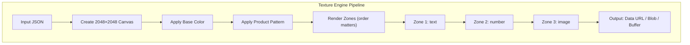
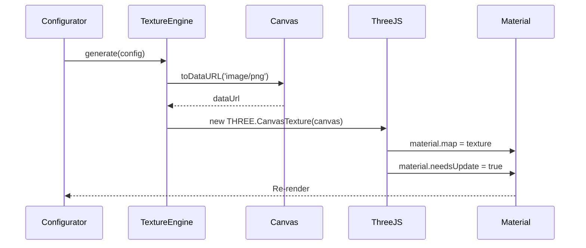

# Texture Engine

## Overview

The Texture Engine is the core system responsible for generating deterministic 2D textures from product configuration. It produces pixel-accurate output that maps directly to Three.js materials via UV coordinates. Same input JSON always produces the same output texture.

---

## Pipeline Overview



---

## Input Schema

```typescript
export interface TextureEngineInput {
  product_id: string;
  color: string; // Hex, e.g. "#FF0000"
  zones: ZoneInput[];
}

export interface ZoneInput {
  zone_id: string;
  type: 'text' | 'number' | 'image';
  content: string; // Text content, number, or image URL/base64
  position?: { x: number; y: number } | 'center';
  scale?: number;
  rotation?: number; // Degrees
  font?: string;
  fontSize?: number;
  fill?: string;
  maxWidth?: number;
  maxHeight?: number;
}
```

---

## Zone Schema (Product Definition)

Zones are defined in the product's `zones` JSONB in the database or CMS:

```typescript
export interface ZoneDefinition {
  zone_id: string;
  name: string;
  uv: {
    x: number;      // Pixel offset in 2048 texture
    y: number;
    width: number;
    height: number;
  };
  type: 'text' | 'number' | 'image';
  constraints?: {
    max_characters?: number;
    max_width?: number;
    max_height?: number;
    allowed_formats?: string[]; // ['png', 'jpg', 'svg']
    font_options?: string[];
  };
  defaults?: {
    font?: string;
    fontSize?: number;
    fill?: string;
  };
  pricing_modifier?: number;
}
```

---

## Zone Type Handling

| Type | Content | Rendering |
|------|---------|-----------|
| **text** | `content` string | Canvas `fillText()` with font, size, color from zone defaults or input |
| **number** | `content` string (numeric) | Same as text; typically jersey numbers, limited characters |
| **image** | `content` string (URL or base64) | Load image, draw to canvas at zone UV bounds |

---

## Determinism Rules

1. **No randomness** — All transformations are calculated from input.
2. **Fixed resolution** — Base canvas is always 2048×2048.
3. **Fixed zone order** — Zones rendered in array order; later zones overlay earlier.
4. **Reproducible fonts** — Use system fonts or preloaded web fonts; font loading must complete before render.
5. **Image caching** — Same image URL → same decoded pixels; no caching key variation.

---

## Execution Flow

```typescript
async function generateTexture(input: TextureEngineInput): Promise<TextureOutput> {
  const canvas = document.createElement('canvas');
  canvas.width = 2048;
  canvas.height = 2048;
  const ctx = canvas.getContext('2d')!;

  // 1. Apply base color
  ctx.fillStyle = input.color;
  ctx.fillRect(0, 0, 2048, 2048);

  // 2. Apply product pattern (if any)
  const pattern = await loadPattern(input.product_id);
  if (pattern) ctx.drawImage(pattern, 0, 0, 2048, 2048);

  // 3. Render zones in order
  const product = await getProduct(input.product_id);
  for (const zoneDef of product.zones) {
    const zoneInput = input.zones.find((z) => z.zone_id === zoneDef.zone_id);
    if (!zoneInput) continue;

    const { x, y, width, height } = zoneDef.uv;
    ctx.save();
    ctx.translate(x, y);

    switch (zoneDef.type) {
      case 'text':
      case 'number':
        renderText(ctx, zoneInput, zoneDef, width, height);
        break;
      case 'image':
        await renderImage(ctx, zoneInput, width, height);
        break;
    }
    ctx.restore();
  }

  return { dataUrl: canvas.toDataURL('image/png'), blob: await canvasToBlob(canvas) };
}
```

---

## Integration with Three.js



```typescript
// React Three Fiber usage
const texture = useMemo(() => {
  const canvas = textureEngine.renderToCanvas(config);
  return new THREE.CanvasTexture(canvas);
}, [config]);

useEffect(() => {
  if (meshRef.current?.material) {
    meshRef.current.material.map = texture;
    meshRef.current.material.needsUpdate = true;
  }
}, [texture]);
```

---

## Output Formats

| Format | Method | Use Case |
|--------|--------|----------|
| **Data URL** | `canvas.toDataURL('image/png')` | Client preview, immediate display |
| **Blob** | `canvas.toBlob(callback)` | Upload, FormData |
| **Buffer** | Node canvas `Buffer.from(canvas.toBuffer())` | Server-side export, storage |

---

## Server-Side Rendering

For production export, the same logic runs server-side using `node-canvas` or `@napi-rs/canvas`:

```typescript
import { createCanvas } from 'canvas';

export async function generateProductionTexture(
  input: TextureEngineInput
): Promise<Buffer> {
  const canvas = createCanvas(2048, 2048);
  const ctx = canvas.getContext('2d');
  // Same pipeline as client
  // ...
  return canvas.toBuffer('image/png');
}
```

---

## Performance Considerations

| Strategy | Implementation |
|----------|----------------|
| **Debounce** | Debounce texture regeneration on config change (e.g. 150ms) |
| **Resolution** | 2048×2048 for production; optional 1024 for preview |
| **Lazy images** | Preload images before render; cache in memory |
| **Web Workers** | Offload canvas work to worker for heavy configs |

---

## Zone UV Mapping

UV coordinates in the zone schema map directly to texture pixels:

```
(0,0)                    (2048,0)
  +---------------------------+
  |                           |
  |   +---- Zone (x,y,w,h)    |
  |   |                       |
  |   +----                   |
  |                           |
  +---------------------------+
(0,2048)                 (2048,2048)
```

- `x`, `y`: Top-left corner in texture space
- `width`, `height`: Bounding box for the zone
- Text is centered within the zone by default
- Images are scaled to fit within the zone while preserving aspect ratio
